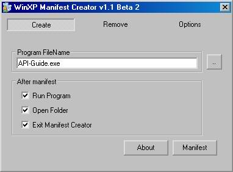



## XP Manifest Creator v1\.1 Beta 2

### Description

(Original concept by Hectorized). Advanced Manifest Creation can be done with this tool. It keeps track of every program 'manifestet', so the user easily can remove manifest it again. Shell integration makes it easy to create/remove manifests again :) . Program distribution is also included.

Thanks to those who wrote some of the code i used.

NOTE : Using manifests can slow down the target program!!!
 
### More Info
 

             |
---                |---
**Submitted On**   |2001-12-23 15:24:34
**By**             |[rudz](https://github.com/Planet-Source-Code/PSCIndex/blob/master/ByAuthor/rudz.md)
**Level**          |Beginner
**User Rating**    |5.0 (15 globes from 3 users)
**Compatibility**  |VB 6\.0
**Category**       |[Complete Applications](https://github.com/Planet-Source-Code/PSCIndex/blob/master/ByCategory/complete-applications__1-27.md)
**World**          |[Visual Basic](https://github.com/Planet-Source-Code/PSCIndex/blob/master/ByWorld/visual-basic.md)
**Archive File**   |[XP\_Manifes4372512232001\.zip](https://github.com/Planet-Source-Code/rudz-xp-manifest-creator-v1-1-beta-2__1-30061/archive/master.zip)

